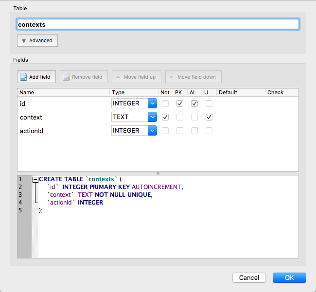

1. Inititialize yarn

`
yarn init
`

2. Make the package.json look like so

```
{
  "name": "Sprint-Challenge-RDBMS",
  "version": "1.0.0",
  "main": "index.js",
  "repository": "https://github.com/blkfltchr/Sprint-Challenge-RDBMS.git",
  "license": "MIT",
  "scripts": {
    "start": "nodemon server.js"
  },
  "dependencies": {
    "express": "^4.16.3",
    "knex": "^0.15.2",
    "nodemon": "^1.18.3",
    "sqlite3": "^4.0.2"
  }
}

```

3. Create a basic `server.js` file

```
const express = require('express');

const server = express();

server.use(express.json());

const port = 3300;

server.listen(port, function() {
    console.log(`\n--- Web API Listening on http://localhost:${port} ---\n`);
})
```

4. Intitalize knex

`
knex init
`

5. Create a `/data` folder and create a `.sqlite3` file inside the folder on db browser - change the code below in the `knexfile.js` to the appropriate file name

```
connection: {
      filename: './data/[PROJECT_NAME].sqlite3'
    }
``` 

6. Create the database in db browser

7. To make sure the knex knows to use the development version, add this property to the development section of `knexfile.js`

```
useNullAsDefault: true
```

8. Create a basic `db.js` file

```
const config = require('../knexfile');

const knex = require('knex');

module.exports = knex(config.development);
```

9. Make sure the server is running with the following code on `server.js`

```
server.get('/', (req, res) => {
    res.send('up and running...')
})
```

10. Create a `/routes` folder and fill it with `apiRouter.js`, `[TABLE_NAME]Routes.js`, `[TABLE_NAME]Routes.js`, `[TABLE_NAME]Routes.js` files

11. `apiRouter.js` should look something like this

```
const express = require('express');
const server = express.Router();

const [TABLE_NAME]Routes = require('./[TABLE_NAME]Routes');
const [T_NAME]Routes = require('./[T_NAME]Routes');
const [T_NAME]Routes = require('./[T_NAME]Routes');

server.use('/[T_NAME]s', [T_NAME]Routes);
server.use('/[T_NAME]s', [T_NAME]Routes);
server.use('/[T_NAME]s', [T_NAME]Routes);

module.exports = server;
```

12. Add this to the `server.js` file

```
const apiRouter = require('./routes/apiRouter');
server.use('/', apiRouter);
```

13. `[T_NAME]Routes.js`, `[T_NAME]Routes.js` and `[T_NAME]Routes.js` should look something like this

```
const express = require('express');
const server = express.Router();
const db = require('../data/db');

// endpoints go here

 module.exports = server;
```

 14. Add CRUD to `routes.js` files (see the `projectRoutes.js` file below)

 ```
 // endpoints go here

server.get('/', (req, res) => {
    db('projects')
        .then(project => {
            res.status(200).json(project);
        })
        .catch(err => res.status(500).json(err));
});

server.get('/:id', (req, res) => {
    const { id } = req.params;
    db('projects')
        .where({ id: Number(id) })
        .then(response => {
            res.status(200).json(response);
        })
        .catch(err => res.status(500).json(err));
});

server.post('/', (req, res) => {
    const project = req.body;
    const { name, description, completed } = project;

    db.insert(project)
        .into('projects')
        .then(ids => {
            const id = ids[0];
            res.status(201).json({ id, ...project });
        })
        .catch(err => {
            res.status(500).json(err);
        });
});

server.delete('/:id', (req, res) => {
    const { id } = req.params;
    db('projects')
        .where({ id: Number(id) })
        .delete()
        .then(response => {
            res.status(200).json(response);
        })
        .catch(err => res.status(500).json(err));
});

server.put('/:id', (req, res) => {
    const id = req.params.id;
    const {name, description, completed} = req.body;
    if (!name) res.status(400).json({ err });
    else {
        db('projects')
            .where({ id: Number(id) })
            .update({name, description, completed})
            .then(project => {
                if (project > 0) res.status(200).json(project);
                else res.status(400).json({ err });
            })
            .catch(err => res.status(500).json(err));
    }
});
```

15. Create seeds files with Knex

```
$ knex seed:make 01_users
$ knex seed:make 02_tasks
```

16. Seed files look something like this

```

exports.seed = function(knex, Promise) {
  // Deletes ALL existing entries
  return knex('projects').del()
    .then(function () {
      // Inserts seed entries
      return knex('projects').insert([
        {
          "id": 1,
          "name": "Side project 1",
          "description": "Basic react app",
          "completed": "false"
      },
      {
          "id": 2,
          "name": "Side project 2",
          "description": "Fully styled react app with node backend",
          "completed": "false"
      },
      {
          "id": 3,
          "name": "Side project 3",
          "description": "Multi component react app with signin, auth and db on firebase",
          "completed": "false"
      }
      ]);
    });
};
```

17. Go into db browser and create another table



18. Seed the data using knex in a similar way to #16

```
exports.seed = function(knex, Promise) {
  // Deletes ALL existing entries
  return knex('contexts').del()
    .then(function () {
      // Inserts seed entries
      return knex('contexts').insert([
        {
          "id": 1,
          "context": "at home",
          "actionId": 1
      },
      {
          "id": 2,
          "context": "at work",
          "actionId": 1
      },
      {
          "id": 3,
          "context": "at computer",
          "actionId": 1
      }
      ]);
    });
};
```

19. Create an endpoint in `actionRoutes.js` to GET contexts by actionId

```
server.get('/:id/contexts', (req, res) => {
    db('contexts')
        .where('actionId', req.params.id)
        .then(context => {
            if (context.length > 0) res.status(200).json(context);
            else res.status(200).json({ err });
        })
        .catch(err => res.status(500).json(err));
});
```